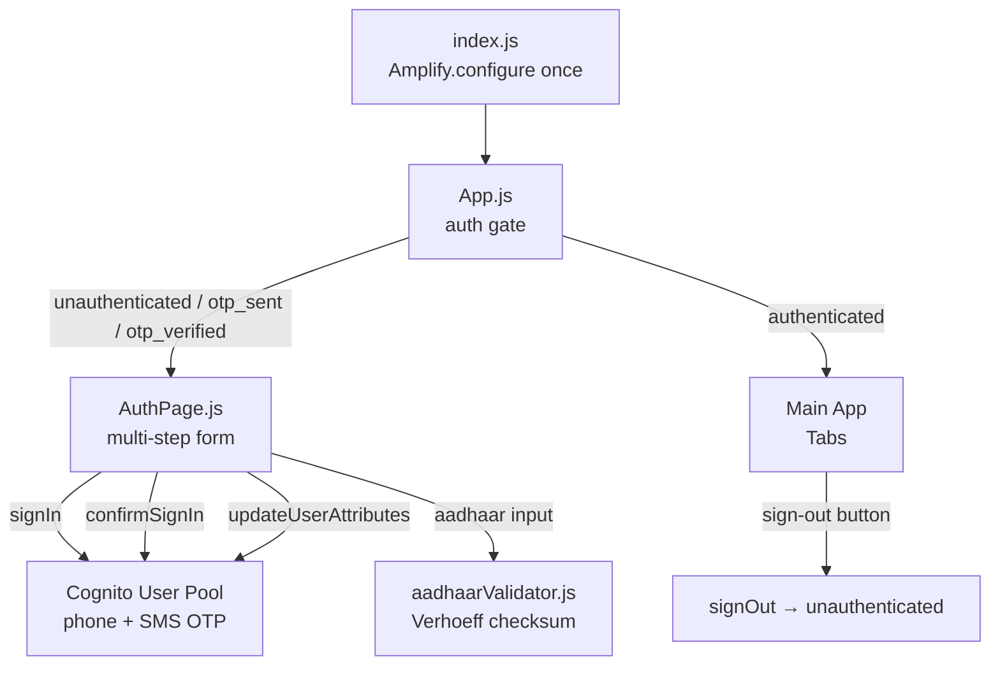

# Design Document: OTP + Aadhaar Authentication

## Overview

This feature adds a multi-step authentication gate to the Paropkar AI React app. Before the main app renders, users must verify their Indian mobile number via SMS OTP (backed by Amazon Cognito + SNS), then optionally verify their Aadhaar number via client-side Verhoeff checksum validation. The feature also fixes three pre-existing bugs: a broken emoji in the header, incorrect Polly voice IDs, and a duplicated offline calculator function.

Auth state machine:

```
unauthenticated → (signIn) → otp_sent → (confirmSignIn) → otp_verified → (Aadhaar or skip) → authenticated
```

On app load, `getCurrentUser` is called first; if a valid Cognito session already exists, the state jumps directly to `authenticated`.

---

## Architecture



**Key decisions:**
- `Amplify.configure` is called once in `index.js`, not inside `amplifyApi.js`, to avoid double-configuration.
- Auth state is managed in `App.js` via a `useState` hook; `AuthPage` receives state and callbacks as props.
- Aadhaar validation is pure client-side — no network call is made for Aadhaar.
- Session persistence is handled entirely by Amplify's built-in storage (no custom localStorage logic needed).

---

## Components and Interfaces

### `src/index.js` (modified)
- Calls `Amplify.configure(awsconfig)` once before rendering.
- Removes the `Amplify.configure` call from `amplifyApi.js`.

### `src/aws-exports.js` (modified)
Adds Cognito fields alongside existing REST API config:
```js
const awsmobile = {
  aws_project_region: "ap-south-1",
  aws_cognito_region: "ap-south-1",
  aws_user_pools_id: "PLACEHOLDER_USER_POOL_ID",
  aws_user_pools_web_client_id: "PLACEHOLDER_APP_CLIENT_ID",
  aws_cloud_logic_custom: [ /* existing */ ]
};
```

### `src/AuthPage.js` (new)
Props:
```js
AuthPage({ authState, setAuthState, phoneNumber, setPhoneNumber })
```
Internal state: `otp`, `aadhaar`, `loading`, `error`, `resendTimer`, `phoneForResend`

Steps rendered based on `authState`:
- `unauthenticated` → phone entry form
- `otp_sent` → OTP entry form + resend timer
- `otp_verified` → Aadhaar entry form + skip button

Calls (from `aws-amplify/auth`): `signIn`, `confirmSignIn`, `updateUserAttributes`, `signOut`

### `src/aadhaarValidator.js` (new)
```js
export function validateAadhaar(number) // returns { valid: boolean, error?: string }
export function maskAadhaar(number)      // returns "XXXX XXXX XXXX" with last 4 visible — wait, spec says first 8 replaced
                                         // returns "XXXX XXXX " + last4
```
Implements the Verhoeff algorithm (multiplication table `d`, permutation table `p`, inverse table `inv`).

### `src/App.js` (modified)
- Imports `getCurrentUser`, `signOut` from `aws-amplify/auth`.
- On mount, calls `getCurrentUser()` to check for existing session.
- Renders `<AuthPage>` when `authState !== 'authenticated'`, otherwise renders existing tabs.
- Adds sign-out button to header.
- Fixes broken emoji: replaces `��` with `🤝`.
- Removes `localCalc` function and its call site (uses `calculateDeadline` from `amplifyApi.js`).

### `src/amplifyApi.js` (modified)
- Removes `Amplify.configure` call (moved to `index.js`).
- Fixes `speakText`: `en-IN` → `"Kajal"`, `hi-IN` → `"Aditi"`.

---

## Data Models

### Auth State
```js
// authState: 'unauthenticated' | 'otp_sent' | 'otp_verified' | 'authenticated'
```

### Aadhaar Verhoeff Tables
```js
// Multiplication table (10x10)
const d = [[0,1,2,...], ...]
// Permutation table (8x10)
const p = [[0,1,2,...], ...]
// Inverse table
const inv = [0,4,3,2,1,9,8,7,6,5]
```

### Masked Aadhaar (stored in Cognito custom attribute)
```
Input:  "123456789012"
Stored: "XXXX XXXX 9012"
```

---

## Correctness Properties

*A property is a characteristic or behavior that should hold true across all valid executions of a system — essentially, a formal statement about what the system should do. Properties serve as the bridge between human-readable specifications and machine-verifiable correctness guarantees.*

### Property 1: Phone number validation accepts only valid Indian mobile numbers

*For any* string input to the phone validation function, it should be accepted if and only if it matches the pattern `^\+91[0-9]{10}$` — exactly `+91` followed by exactly 10 digits, with no other characters.

**Validates: Requirements 1.2, 1.3**

### Property 2: OTP input accepts only 6-digit numeric strings

*For any* string input to the OTP validation function, it should be accepted if and only if it consists of exactly 6 numeric characters (0–9) and nothing else.

**Validates: Requirements 2.2**

### Property 3: Aadhaar Verhoeff validation is correct for all 12-digit inputs

*For any* 12-digit numeric string, `validateAadhaar` should return `valid: true` if and only if the Verhoeff checksum of the full number is 0. Known-valid Aadhaar numbers must pass; numbers with any single digit changed must fail (Verhoeff detects all single-digit errors and adjacent transpositions).

**Validates: Requirements 3.3, 3.4**

### Property 4: Aadhaar masking always exposes only the last 4 digits

*For any* valid 12-digit Aadhaar number, `maskAadhaar` should return a string where the first 8 digits are replaced with `"XXXX XXXX"` and only the last 4 digits are visible, regardless of the input value.

**Validates: Requirements 3.5**

### Property 5: speakText selects the correct Polly voice for each language code

*For any* call to `speakText` with a supported language code, the `voiceId` field in the Lambda request body should equal `"Kajal"` when `language` is `"en-IN"` and `"Aditi"` when `language` is `"hi-IN"`.

**Validates: Requirements 8.1, 8.2, 8.3**

---

## Error Handling

| Scenario | Handling |
|---|---|
| Invalid phone format | Inline error, no Cognito call |
| Cognito `signIn` failure | Display Cognito error message, stay on phone step |
| Invalid / expired OTP | Display error, allow re-entry, resend available after 30s |
| Invalid Aadhaar checksum | Inline error, no network call |
| `getCurrentUser` throws (no session) | Silently transition to `unauthenticated` |
| Missing Cognito config fields | Display config error, block sign-in flow |
| `updateUserAttributes` failure | Log warning, still transition to `authenticated` (Aadhaar is optional) |

---

## Testing Strategy

### Unit Tests (Jest / React Testing Library)

Focus on specific examples, edge cases, and integration points:

- `aadhaarValidator.js`: known-valid Aadhaar numbers pass; known-invalid fail; non-12-digit inputs fail; masking output format
- `AuthPage.js`: renders phone step initially; transitions to OTP step on valid submit; transitions to Aadhaar step on OTP confirm; skip Aadhaar transitions to authenticated; sign-out clears state
- `App.js`: existing session skips auth; sign-out button present when authenticated; emoji renders correctly
- `amplifyApi.js`: `speakText` uses correct voice IDs; `calculateDeadline` falls back to local on Lambda failure

### Property-Based Tests (fast-check)

Use [fast-check](https://github.com/dubzzz/fast-check) (compatible with Jest / react-scripts).

Minimum 100 iterations per property. Each test is tagged with a comment referencing the design property.

**Property 1 — Phone validation**
```js
// Feature: otp-aadhaar-authentication, Property 1: phone validation accepts only +91 + 10 digits
fc.assert(fc.property(fc.string(), (s) => {
  const valid = /^\+91[0-9]{10}$/.test(s);
  expect(validatePhone(s).valid).toBe(valid);
}), { numRuns: 100 });
```

**Property 2 — OTP validation**
```js
// Feature: otp-aadhaar-authentication, Property 2: OTP accepts only 6-digit numeric strings
fc.assert(fc.property(fc.string(), (s) => {
  const valid = /^[0-9]{6}$/.test(s);
  expect(validateOtp(s).valid).toBe(valid);
}), { numRuns: 100 });
```

**Property 3 — Aadhaar Verhoeff**
```js
// Feature: otp-aadhaar-authentication, Property 3: Verhoeff checksum correctness
fc.assert(fc.property(fc.stringMatching(/^[0-9]{12}$/), (n) => {
  const result = validateAadhaar(n);
  expect(result.valid).toBe(verhoeffCheck(n));
}), { numRuns: 100 });
```

**Property 4 — Aadhaar masking**
```js
// Feature: otp-aadhaar-authentication, Property 4: masking exposes only last 4 digits
fc.assert(fc.property(fc.stringMatching(/^[0-9]{12}$/), (n) => {
  const masked = maskAadhaar(n);
  expect(masked).toMatch(/^XXXX XXXX [0-9]{4}$/);
  expect(masked.slice(-4)).toBe(n.slice(-4));
}), { numRuns: 100 });
```

**Property 5 — Voice ID mapping**
```js
// Feature: otp-aadhaar-authentication, Property 5: correct Polly voice per language
const cases = [['en-IN', 'Kajal'], ['hi-IN', 'Aditi']];
fc.assert(fc.property(fc.constantFrom(...cases), ([lang, expectedVoice]) => {
  const body = captureRequestBody(() => speakText('test', lang));
  expect(body.voiceId).toBe(expectedVoice);
  expect(body.languageCode).toBe(lang);
}), { numRuns: 100 });
```

Each correctness property is implemented by exactly one property-based test. Unit tests handle the remaining example-based and edge-case criteria.
